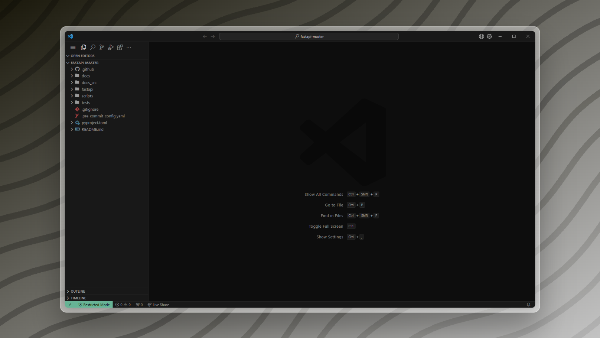
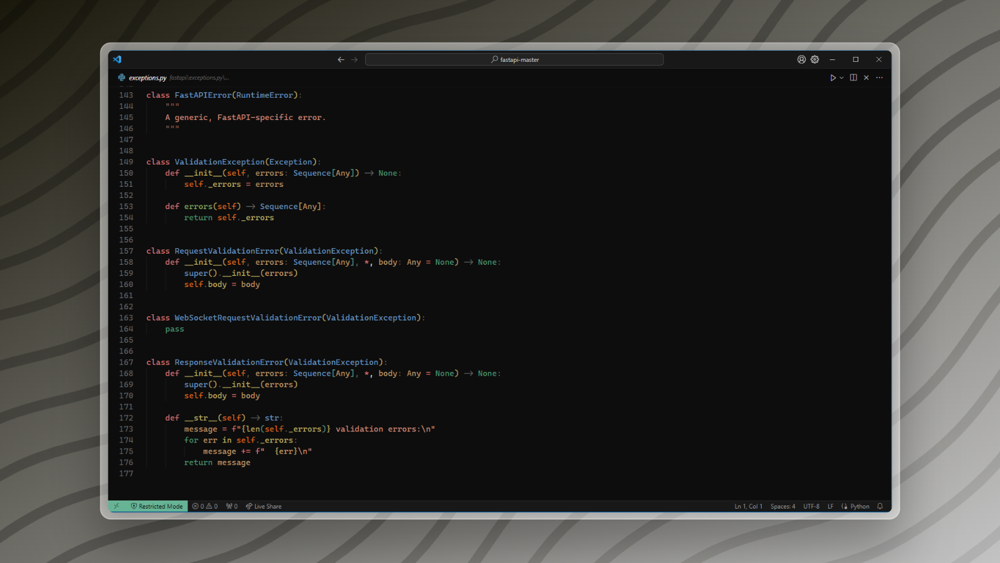
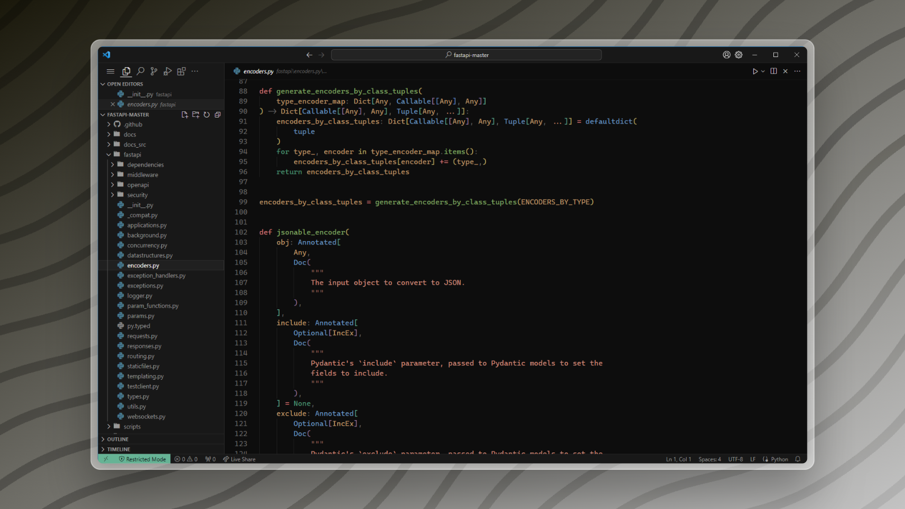
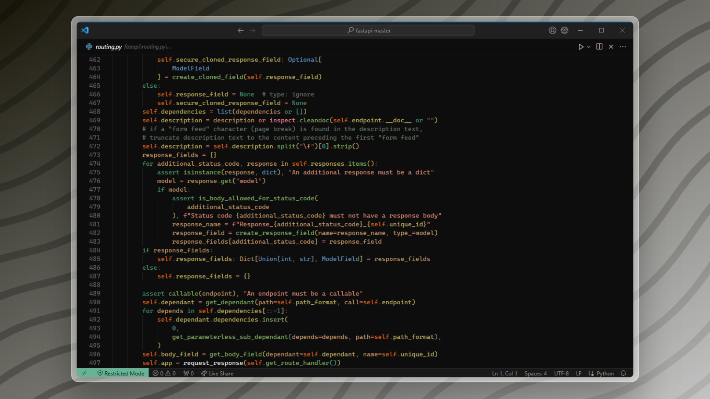

# dot-vscode

Rainzee's VS Code settings, carefully curated for python development. A Minimalist in Practice.

### Screenshots

### 🎨 Theme

- Moegi Theme (ddiu8081.moegi-theme)
- File Icons (file-icons.file-icons)

### 🔌 Plugins

- eamodio.gitlens
- adpyke.codesnap
- antfu.file-nesting
- usernamehw.errorlens
- gruntfuggly.todo-tree
- aykutsarac.jsoncrack-vscode

### 🐍 Python Development

- Python (ms-python.python)
- Pylance (ms-python.vscode-pylance)
- Ruff (charliermarsh.ruff)

### 📦 Optional Enhancements

- alefragnani.project-manager
- jock.svg
- github.vscode-github-actions
- vscodevim.vim
- github.vscode-pull-request-github
- wakatime.vscode-wakatime
